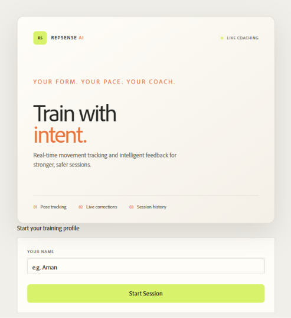
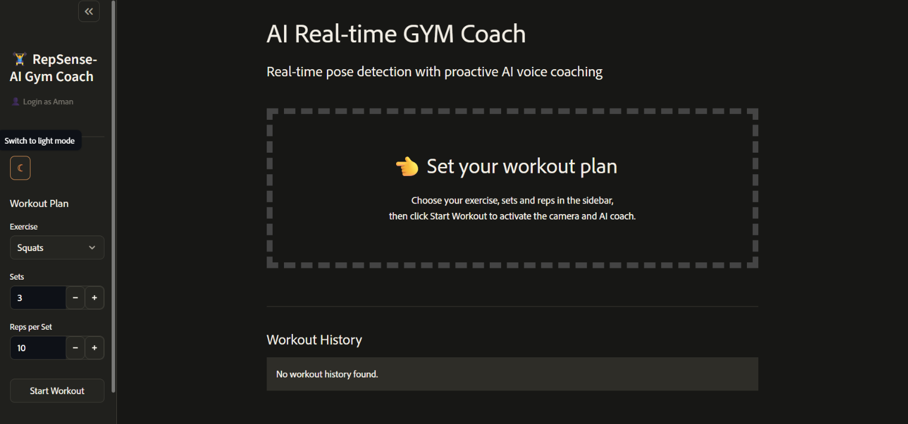
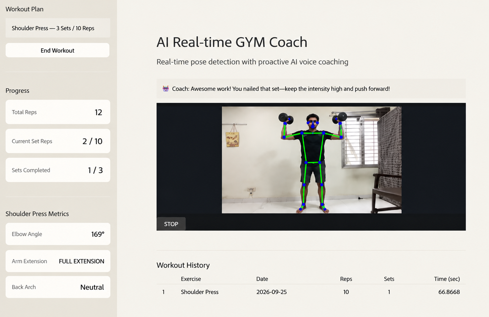
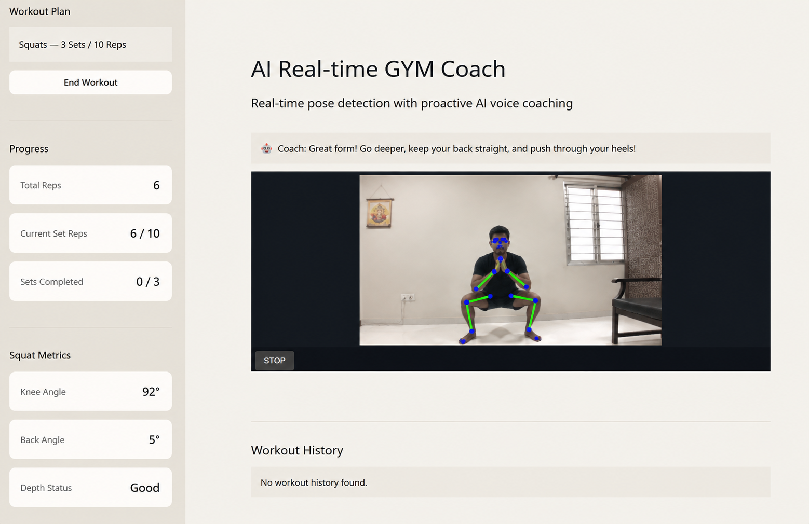
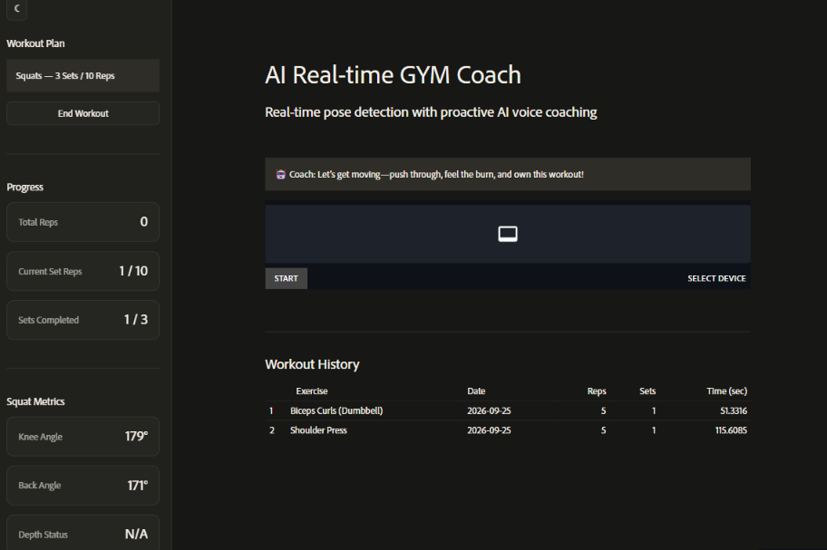
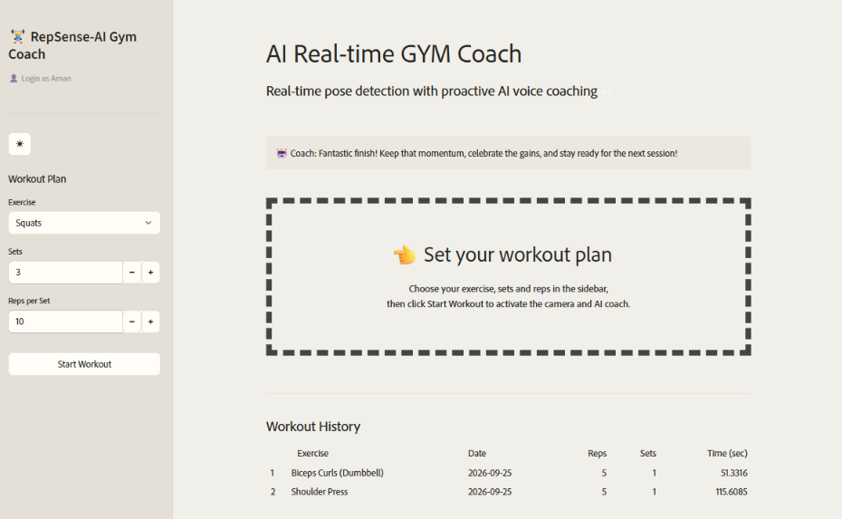

# RepSense - AI Gym Coach Trainer

> A bold, responsive landing page for RepSense, a real-time AI gym coach that helps athletes understand their form, track their progress, and train with better feedback.

[](https://repsense-ai-gym-coach.netlify.app/)

## Overview

This repository contains the presentation website for **RepSense - Real-time AI Gym Coach Trainer**. The page introduces the product through a focused hero section, a visual product gallery, a demo video, live-app calls to action, and direct links to the project creator.

The underlying RepSense application uses a camera, computer vision, and AI-assisted coaching to make workout sessions more measurable and more useful. This landing page gives visitors a quick way to understand the product experience.

## Features

### Product presentation

- Clear RepSense branding across the browser title, navigation, hero, and footer.
- Responsive layout designed for desktop and mobile screens.
- Animated, editorial-style visual treatment with a grid overlay, floating gallery cards, and scan-line details.
- Navigation links for the gallery, demo, and contact areas.

### Real-time fitness capabilities

The live RepSense application showcased by this page provides:

- **Browser camera pose detection** using MediaPipe pose landmarks.
- **Automatic repetition counting** while a user performs an exercise.
- **Set tracking** for structured workout sessions.
- **Exercise-specific form metrics** to make movement quality easier to understand.
- **AI coaching feedback** powered by Groq.
- **Optional voice feedback** through text-to-speech.
- **Workout history** stored with SQLite so completed sessions can be reviewed.
- **Light and dark dashboard themes** for a more comfortable training environment.
- **Collapsible sidebar controls** for a focused workout view.

### Supported exercises

RepSense currently supports:

- Squats
- Push-ups
- Dumbbell biceps curls
- Shoulder press
- Lunges

### Landing-page media

- Product screenshots showing the login page, light mode, dark mode, shoulder press, squat, metrics, and workout history views.
- A local demo video in `videos/DemoVideo.mp4`.
- A live-app button connected to the deployed RepSense Streamlit application.
- Contact links for LinkedIn, GitHub, Instagram, and email.

### Product screenshots

<table>
    <tr>
        <td align="center"><strong>Login page</strong><br /></td>
        <td align="center"><strong>Light mode</strong><br /></td>
    </tr>
    <tr>
        <td align="center"><strong>Dark mode</strong><br /></td>
        <td align="center"><strong>Shoulder press</strong><br /></td>
    </tr>
    <tr>
        <td align="center"><strong>Squat tracking</strong><br /></td>
        <td align="center"><strong>Workout metrics</strong><br /></td>
    </tr>
    <tr>
        <td align="center"><strong>Workout history</strong><br /></td>
        <td align="center"><strong>Demo video</strong><br />A product walkthrough is available in <code>videos/DemoVideo.mp4</code>.</td>
    </tr>
</table>

## Tech Stack

### RepSense application

| Area | Technology |
| --- | --- |
| Application UI | Streamlit |
| Pose tracking | MediaPipe Tasks |
| Video processing | OpenCV and streamlit-webrtc |
| AI coaching | Groq |
| Voice output | gTTS |
| Workout persistence | SQLite |
| Styling | Custom CSS |

### This landing page

| Area | Technology |
| --- | --- |
| Structure | HTML5 |
| Styling | CSS3 |
| Fonts | Averta, Ubuntu, and Instrument Serif |
| Media | Local PNG screenshots and MP4 demo video |
| Hosting | Netlify |

## Project Structure

```text
.
├── index.html          # Landing page structure and content
├── style.css           # Layout, responsive styles, effects, and animations
├── fonts/              # Local Averta font asset
├── IMGs/               # RepSense product screenshots
└── videos/
    └── DemoVideo.mp4   # Product walkthrough video
```

## Run Locally

Because this is a static website, no package installation or build command is required.

### 1. Clone the repository

```powershell
git clone https://github.com/Aman05cody/Repsense-Landing-Page.git
cd Repsense-Landing-Page
```

### 2. Start a local server

```powershell
python -m http.server 5500
```

### 3. Open the page

Visit [http://localhost:5500](http://localhost:5500) in your browser.

Using a local HTTP server is recommended instead of opening `index.html` directly because it keeps relative image, font, and video paths working consistently.

## Deployed Landing Page

Explore the product presentation at the [RepSense deployed landing page](https://repsense-ai-gym-coach.netlify.app/).

## Contact

- [LinkedIn](https://www.linkedin.com/in/aman-prasad-bari-3490aa331/)
- [GitHub](https://github.com/Aman05cody)
- [Instagram](https://www.instagram.com/aman_pb.06/)
- [Email](mailto:amanprasadbari05@gmail.com)

## Related Repository

The application source code is maintained separately in the [RepSense AI Gym Coach repository](https://github.com/Aman05cody/RepSense---AI-Gym-Coach).

## License

No license has been specified for this landing-page repository yet.